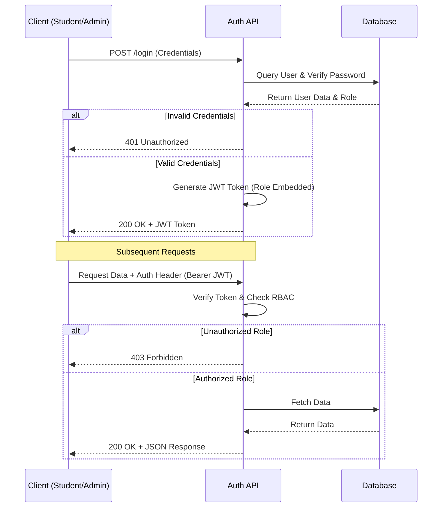
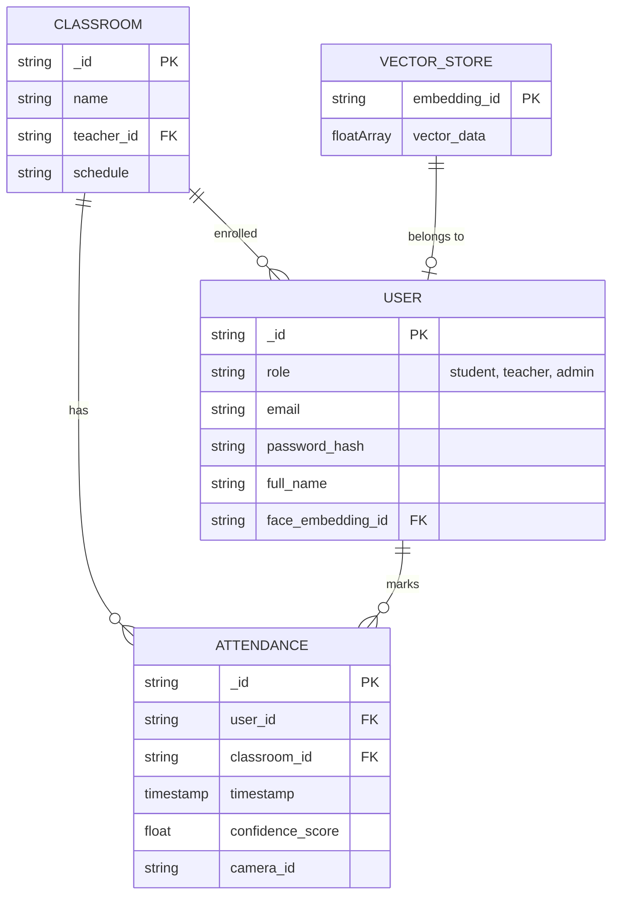
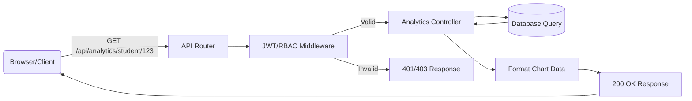
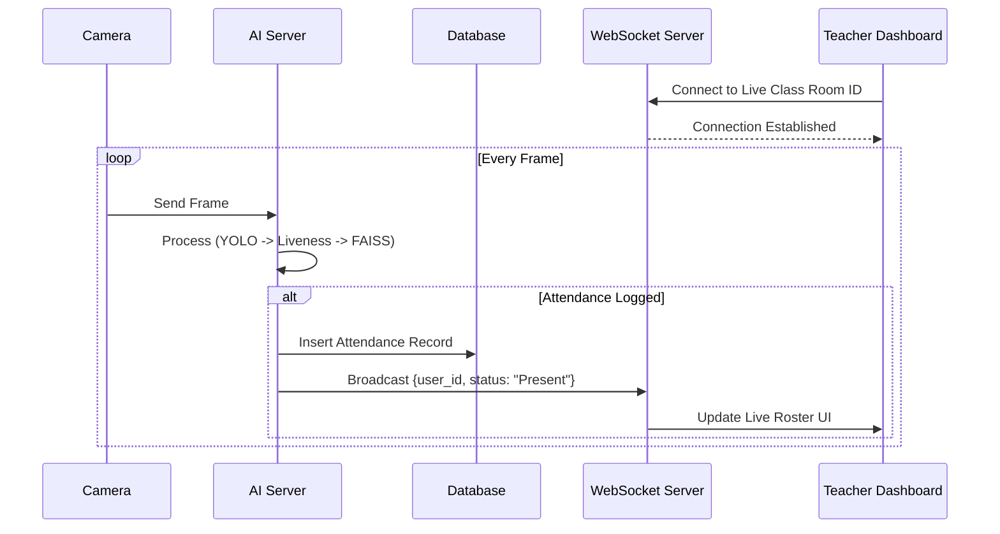
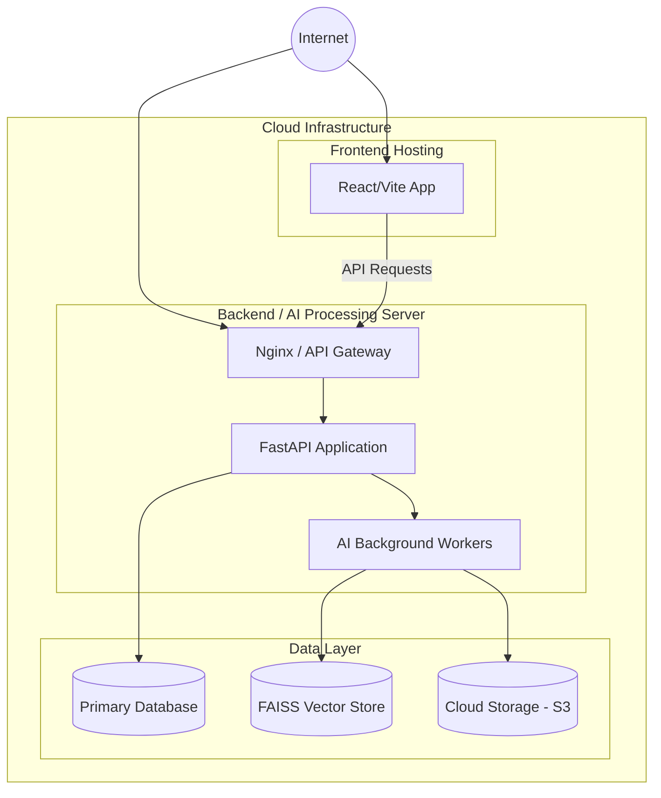

# System Architecture Diagrams

These diagrams provide a comprehensive overview of the AI Attendance System, capturing the high-level flow, processing pipelines, database structure, and deployment architecture.

## 1. High-Level System Architecture Diagram

This diagram illustrates the core components of the system, separating the Frontend, Backend, and AI Modules, along with their primary connections.

```mermaid
flowchart TD
    subgraph Frontend [Frontend (React + Bootstrap)]
        SP[Student Portal]
        TP[Teacher/Admin Portal]
    end

    subgraph Backend [Backend (FastAPI/Node.js)]
        API[REST & WebSocket APIs]
        Auth[Authentication & RBAC]
        Core[Business Logic & Attendance Engine]
    end

    subgraph AI_Modules [AI & ML Processing]
        YOLO[YOLOv12 Face Detection]
        MediaPipe[MediaPipe Liveness]
        FaceNet[FaceNet Embeddings]
        FAISS[FAISS Similarity Search]
    end

    subgraph Database [Database (MongoDB/PostgreSQL)]
        Users[(Users/Roles)]
        Classes[(Classrooms)]
        Logs[(Attendance Logs)]
        Embeddings[(Vector Store)]
    end

    SP <-->|HTTP/WS| API
    TP <-->|HTTP/WS| API
    API --> Auth
    Auth --> Users
    API --> Core
    Core --> AI_Modules
    Core --> Classes
    Core --> Logs
    AI_Modules <--> Embeddings
```

## 2. Attendance Processing Pipeline

This diagram matches the "Live Attendance System" workflow you provided.

```mermaid
flowchart TD
    Start([Camera Input / Video Feed]) --> YOLO
    YOLO[YOLOv12 Face Detection]
    
    YOLO --> CheckFace{Face Detected?}
    CheckFace -- No --> Start
    CheckFace -- Yes --> MediaPipe[MediaPipe Liveness Check]
    
    MediaPipe --> CheckLiveness{Blink/Movement Verified?}
    CheckLiveness -- No --> Reject[Reject (Spoof)]
    CheckLiveness -- Yes --> FaceNet[FaceNet Extraction]
    
    FaceNet --> FAISS[FAISS Similarity Search]
    
    FAISS --> MatchCheck{Match > 70%?}
    MatchCheck -- Yes --> LogSuccess[Log Attendance]
    MatchCheck -- No --> LogUnknown[Unknown Person Alert]
    
    LogSuccess --> Start
    LogUnknown --> Start
    Reject --> Start
```

## 3. Authentication Flow Diagram

This diagram details the JWT and RBAC authentication process.



## 4. Database Schema

A conceptual Entity-Relationship representation of the core data models.



## 5. API Workflow Diagram

Illustrates the flow for a specific dashboard request, such as fetching student analytics.



## 6. Real-Time Attendance Workflow Visualization

Details how the WebSocket pushes live updates to the teacher's dashboard.



## 7. Deployment Architecture

Shows the infrastructure layout for a production environment.


